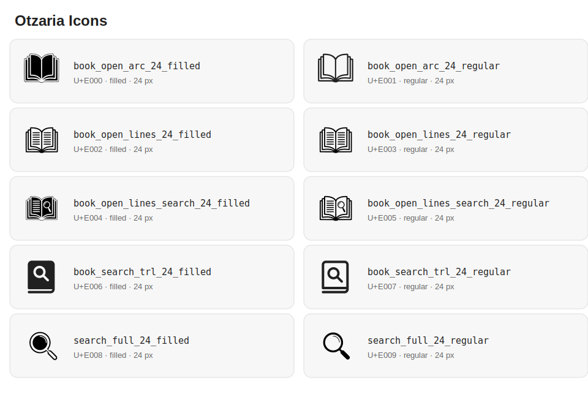

# Otzaria Icons

An unofficial Fluent-style icon extension for Otzaria applications. The package
provides original icons that are missing from Microsoft Fluent UI System Icons,
while following the same public naming convention:

```dart
Icon(OtzariaIcons.book_open_large_24_regular);
```

This package is independent of `fluentui_system_icons`. Applications may use
both packages side by side. The current release is pre-1.0 and distributed from
GitHub by immutable version tags.

Related projects:

- [Otzaria — Jewish library application](https://github.com/Otzaria/otzaria)
- [Microsoft Fluent UI System Icons](https://github.com/microsoft/fluentui-system-icons)

## Available icons

Open the [searchable interactive catalog](index.html) to filter icons by name
and adjust their preview size. The same file can be published directly with
GitHub Pages and is regenerated automatically with the icon font.

The catalog below is also the Windows visual regression test. Every generated
glyph is rendered at 16, 20, 24, 32, and 48 logical pixels so small-size defects
cannot be hidden by a large preview.



## Requirements and compatibility

| Compatibility tier | Version |
| --- | --- |
| Minimum supported Dart | 3.2.6 |
| Minimum supported Flutter | 3.16.9 |
| Current CI/tested Flutter | 3.44.0 |
| Generator toolchain | `icon_font_generator` 4.1.0, exactly pinned |
| Minimum generator Dart | 3.4.0 |
| Otzaria's current Fluent dependency | `fluentui_system_icons` 1.1.273 |

The package has no runtime dependency on Fluent icons. The generator and its
supporting libraries are development-only dependencies. Flutter 3.16.9 support
is tested through a consuming application because the pinned generator itself
requires Dart 3.4 or newer.

## Installation

Use a fixed Git tag, never a moving branch:

```yaml
dependencies:
  fluentui_system_icons: ^1.1.273
  otzaria_icons:
    git:
      url: https://github.com/Otzaria/otzaria_icons
      ref: v0.2.0
```

Then fetch dependencies:

```console
flutter pub get
```

For local package development only, an application may temporarily use:

```yaml
dependencies:
  otzaria_icons:
    path: ../otzaria_icons
```

Do not commit the temporary path dependency to Otzaria. Replace it with a tagged
Git dependency before merging.

## Using icons

Import the package's public entry point:

```dart
import 'package:otzaria_icons/otzaria_icons.dart';
```

Use an icon like any other Flutter `IconData`:

```dart
const Icon(
  OtzariaIcons.book_open_large_24_regular,
  size: 24,
  color: Color(0xFF202020),
  semanticLabel: 'Open book',
);
```

Regular and filled variants are separate constants:

```dart
final icon = isSelected
    ? OtzariaIcons.book_open_large_24_filled
    : OtzariaIcons.book_open_large_24_regular;

return Icon(icon, size: 24);
```

Use Fluent and Otzaria icons together:

```dart
import 'package:fluentui_system_icons/fluentui_system_icons.dart';
import 'package:otzaria_icons/otzaria_icons.dart';

const Icon(FluentIcons.arrow_right_24_regular);
const Icon(OtzariaIcons.book_open_large_search_24_regular);
```

The color comes from `Icon.color`, `IconTheme`, or the surrounding widget.
Source SVG `fill` colors do not create multicolor glyphs. Do not construct a
second `IconData` manually from a raw codepoint; always use the generated
constant so the correct font family and package are retained.

For application-level meaning, define semantic aliases inside the consuming
application rather than in this package:

```dart
abstract final class AppIcons {
  static const librarySearch =
      OtzariaIcons.book_open_large_search_24_regular;
}
```

See [docs/usage.md](docs/usage.md) for accessibility, RTL, theming, and
tree-shaking guidance.

## Public naming convention

Names match this exact pattern:

```text
<descriptive_name>_<size>_<variant>
book_open_large_24_regular
book_open_large_24_filled
```

The current accepted regular expression is:

```regex
^[a-z][a-z0-9_]*_24_(regular|filled)$
```

Public names are `snake_case`, matching `FluentIcons`. Existing names and
codepoints are never silently changed, deleted, or reused.

## Adding an icon

1. Export a valid SVG into `assets_src/svg/`.
2. Use the exact naming convention above.
3. Convert every stroke to a closed filled path.
4. Resolve any overlapping/seaming paths into one clean outline with
   `python3 tool/normalize_svg_overlaps.py` (they render fine in a browser but
   corrupt in the merged font glyph).
5. Run the generator; it validates and sanitizes input, allocates the next
   immutable codepoint, updates the manifest, builds the OTF, repairs glyph
   outlines from source, and regenerates Dart/test/gallery/notices files.
6. Inspect the gallery in regular/filled, light/dark, LTR/RTL, and all supported
   preview sizes.
7. Run the complete validation suite and update `CHANGELOG.md`.

Generation requires Python 3 with `skia-pathops` and `fonttools` in addition to
the Flutter/Dart SDK:

```console
python3 -m pip install -r tool/requirements.txt   # once
dart run tool/generate.dart
dart run tool/generate.dart --check
flutter analyze
flutter test
```

Never edit files marked `GENERATED CODE` or the font file by hand.

Detailed instructions:

- [Adding icons](docs/adding_icons.md)
- [SVG requirements](docs/svg_requirements.md)
- [Architecture and generated files](docs/architecture.md)
- [Testing and CI](docs/testing_and_ci.md)
- [Release process](docs/release_process.md)
- [Visual design specification](docs/icon_design_spec.md)
- [Contributing](CONTRIBUTING.md)

## Repository layout

```text
assets_src/svg/                 original SVG inputs
icon_manifest.yaml             icon identity, codepoints, provenance
tool/config.yaml               generator/build configuration
tool/                          validation and generation pipeline
lib/fonts/                     generated OpenType icon font
lib/src/generated/             generated public IconData constants
example/                       complete visual gallery
test/                          metadata, manifest, render, and golden tests
test_apps/minimal/             one-icon tree-shaking proof application
docs/                          design, development, testing, and release docs
```

## Licensing

All current artwork was created by the project contributor and is released
under GPL-3.0-only. The package source and artwork are covered by
The library and all accepted contributions are licensed under
[GPL-3.0-only](LICENSE).

`THIRD_PARTY_NOTICES.md` is generated from the provenance fields in
`icon_manifest.yaml`. The current release contains no third-party icon artwork.
